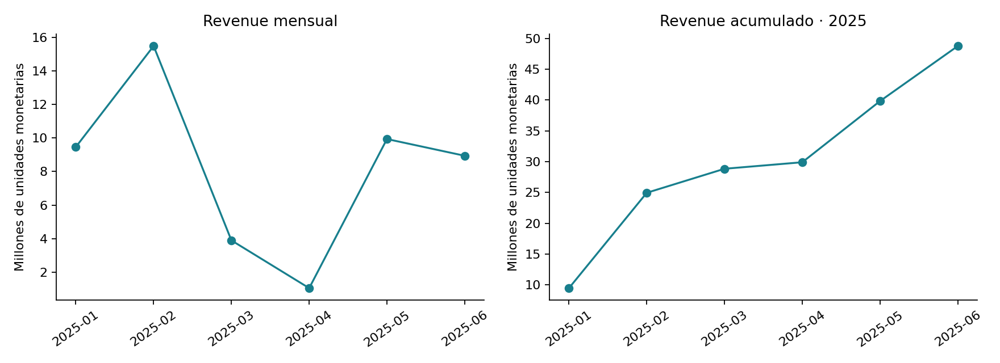
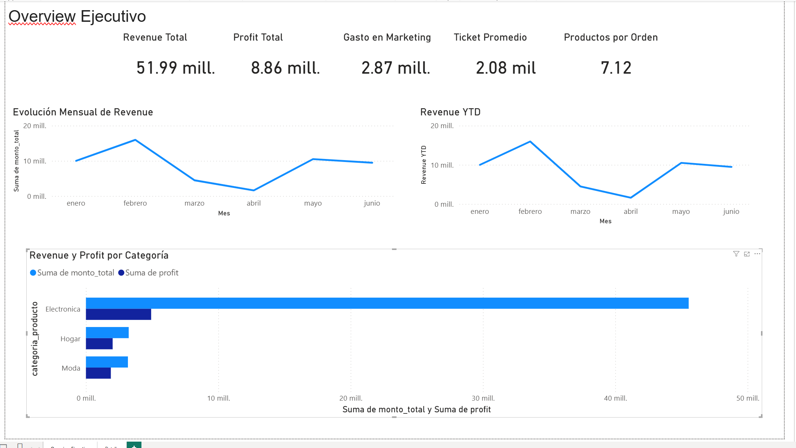
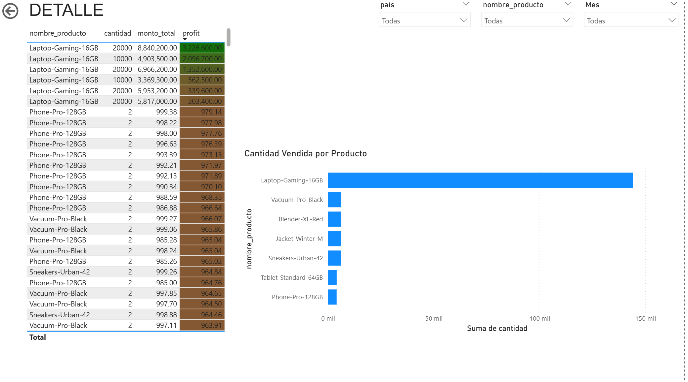

# RappiPlus: de datos a decisiones de negocio

**Mario Alberto Vivero Sahagún | Power BI · Python · SQL**

Análisis comercial de ventas, costos de producto y gasto de marketing de enero a junio de 2025, con un dashboard de dos vistas en Power BI y una validación de los indicadores con Python.

## Pregunta de negocio

¿Qué productos y periodos concentran los ingresos, y qué tan confiables son los indicadores para apoyar decisiones comerciales?

## Hallazgo clave

- **Diez pedidos concentran el 86.83% del revenue.** Tienen entre 10,000 y 20,000 unidades cada uno, y hay que validarlos antes de usar los promedios para planear inventario.
- **Electrónica lidera el revenue y el beneficio bruto conocido**, pero su posición depende de esos pedidos y no implica que tenga el mejor margen.
- **Febrero es el mes con más revenue y abril el de menos.**

**Qué recomiendo:** validar los diez pedidos de gran volumen y completar los productos y canales sin dato antes de planear compras o promociones.

## Resultados reproducidos con los CSV adjuntos

| Indicador | Valor |
|---|---:|
| Pedidos únicos | 18,713 |
| Revenue | 48,768,784.27 |
| Costo de producto conocido | 41,832,828.49 |
| Gasto de marketing | 2,871,843.53 |
| Resultado provisional: revenue − costo conocido − marketing | 4,064,112.25 |
| Ticket promedio por pedido | 2,606.14 |
| Unidades promedio por pedido | 8.82 |
| Unidades de Laptop-Gaming-16GB | 142,752 |

Importes en unidades monetarias del ejercicio; moneda y comparabilidad entre países no confirmadas. **El resultado provisional no es beneficio neto:** faltan costos para 21 pedidos y no se incluyen otros gastos operativos. Los CSV no contienen columnas de costo o profit por pedido; estas se calculan al integrar el catálogo.

### Hallazgos para la decisión

- **Diez pedidos concentran 86.83% del revenue.** Tienen entre 10,000 y 20,000 unidades cada uno y requieren validación antes de usar los promedios para planear inventario.
- **Electrónica lidera el revenue y el beneficio bruto conocido**, pero su posición depende fuertemente de esos pedidos. No implica que tenga el mejor margen porcentual ni que se deba aumentar inversión.
- **Febrero tiene el mayor revenue mensual; abril el menor.** Mayo se recupera y junio queda por debajo de mayo. La evolución no debe describirse como un pico conjunto de febrero–marzo.
- **El dashboard histórico y el CSV limpio pertenecen a estados distintos del análisis.** Se documentan ambos para evitar mezclar cifras.

## Dashboard original en Power BI

Las siguientes capturas se extrajeron de los notebooks aportados. Son evidencia histórica y no corresponden a una actualización del dashboard con los CSV actuales.

### Overview ejecutivo

Tarjetas, evolución mensual y comparación por categoría. La captura muestra revenue de 51.99 millones y profit de 8.86 millones; **no son los totales recalculados de la tabla anterior**. La línea rotulada YTD desciende entre meses y requiere revisión de medida y contexto de fechas.

### Detalle

Tabla de productos, cantidad, importe y profit con formato condicional, gráfico de unidades y filtros por país, producto y mes. El autor describe navegación drill-through; su funcionamiento no pudo comprobarse sin el archivo Power BI.

**No se incluye un PBIX ni un dashboard interactivo:** no formaban parte de los adjuntos. Las capturas permiten revisar el diseño; las relaciones, medidas DAX y navegación permanecen sin verificar. Ver [conciliación y revisión de Power BI](docs/conciliacion_dashboard.md).

## Método

1. Inspeccionar fechas, claves, nulos y duplicados en los CSV.
2. Integrar órdenes y catálogo mediante producto, validando una relación muchos-a-uno.
3. Calcular costos por línea y separar costos desconocidos de costos cero.
4. Sumar marketing independientemente para evitar multiplicarlo al unirlo a cada pedido.
5. Recalcular KPIs, analizar concentración y comparar ingreso mensual con acumulado anual.

Los tres CSV se conservan sin modificaciones. La revisión ejecutable añade controles y conciliación; no pretende haber actualizado el archivo Power BI original.

## Calidad y límites

- 21 pedidos sin producto identificable representan 6,441.07 de revenue; sus costos quedan desconocidos.
- Hay 218 pedidos sin país, 16 sin dispositivo y 21 sin fuente de referencia. Los nombres terminados en `_clean` no garantizan ausencia de nulos.
- 101 registros de marketing carecen de canal y suman **177,179.10**. Deben figurar como «sin canal» para conciliar los desgloses.
- Órdenes cubre del 1 de enero al 30 de junio de 2025; marketing llega hasta el 29 de junio. La cobertura debe revisarse antes de interpretar comparaciones diarias.
- La limpieza histórica revisada filtró 6,256 filas por diferencias de monto exacto. Sin los archivos brutos no se confirmó si eran errores reales, diferencias de redondeo u otra causa. Los resultados describen el subconjunto conservado.

## Recomendaciones

1. Validar los diez pedidos de gran volumen y medir su influencia antes de planear compras o promociones.
2. Completar los productos sin correspondencia y los canales faltantes, manteniendo visibles las categorías sin dato.
3. Conciliar las fuentes de Power BI y definir profit: beneficio bruto por producto o resultado después de marketing son métricas diferentes.
4. Revisar el calendario y el acumulado YTD. No atribuir rentabilidad total a productos sin una política explícita de asignación de marketing y otros gastos.

## Archivos y ejecución

| Archivo o carpeta | Contenido y estado |
|---|---|
| [Validación comercial](notebooks/validacion_comercial.ipynb) | Ejecutada con los tres CSV; incluye resultados y gráficos |
| [Preparación histórica](notebooks/preparacion_historica.ipynb) | Extracto del original revisado; salidas históricas; necesita fuentes brutas |
| [Experimento histórico](notebooks/experimento_historico.ipynb) | Código y salidas guardadas; requiere fuente no adjunta |
| `data/` | Los tres CSV recibidos, sin modificar |
| `sql/` | Consultas históricas de eventos y cohortes, sin credenciales; no ejecutadas aquí |
| [Análisis complementarios](docs/analisis_complementarios.md) | Alcance del funnel, cohortes y experimento |

Instala con `python -m pip install -r requirements.txt`, ejecuta `jupyter notebook` y abre `notebooks/validacion_comercial.ipynb`. Funciona desde la raíz del repositorio o desde `notebooks/`, sin red ni conexión a bases de datos. Las versiones de pandas y Matplotlib corresponden al entorno usado; no se probó una instalación nueva con pip.

El dataset es material académico. No se verificó su licencia ni se otorga una licencia abierta a datos o capturas. No se publican credenciales de los notebooks originales.
